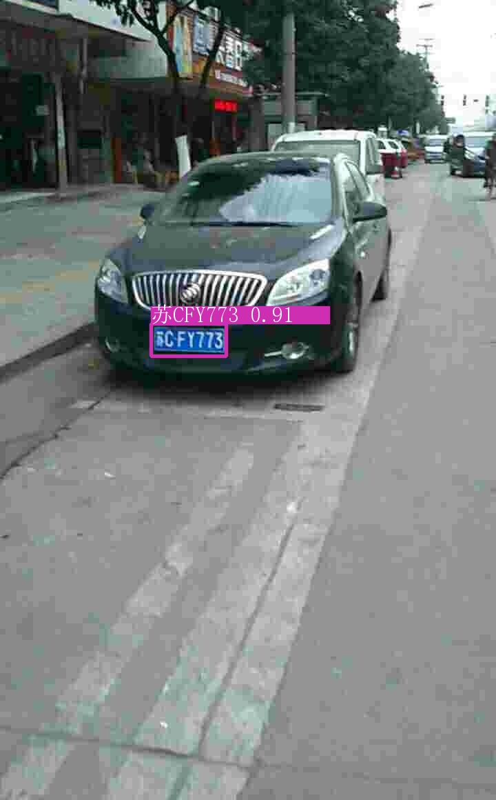

# 车牌识别项目（CCPD数据集）

这个项目是使用YOLOv5s和LPRNet对CCPD车牌进行检测和识别。之前一直在学习OCR相关的东西，就想着能不能做一个车牌识别的项目出来，
刚好车牌检测以前也做过，直接用YOLOv5就可以了。我的打算是做一个轻量级的车牌识别项目，用YOLOv5s进行车牌检测，用LPRNet进行车牌识别。

目前仅支持识别蓝牌和绿牌（新能源车牌）等中国车牌。后续如果添加数据，可以再继续微调，可支持更多场景和更多类型车牌，提高识别准确率！

主要参考以下四个仓库：

1. Github: [https://github.com/ultralytics/yolov5](https://github.com/ultralytics/yolov5)
2. Github: [https://github.com/sirius-ai/LPRNet_Pytorch](https://github.com/sirius-ai/LPRNet_Pytorch)
3. [https://gitee.com/reason1251326862/plate_classification](https://gitee.com/reason1251326862/plate_classification)
4. [https://github.com/kiloGrand/License-Plate-Recognition](https://github.com/kiloGrand/License-Plate-Recognition)

如果对YOLOv5不熟悉的同学可以先看看我写的YOLOv5源码讲解CSDN:
[【YOLOV5-5.x 源码讲解】整体项目文件导航](https://blog.csdn.net/qq_38253797/article/details/119043919)

注释版YOLOv5源码我也开源在了Github上：
[HuKai97/yolov5-5.x-annotations](https://github.com/HuKai97/yolov5-5.x-annotations)

欢迎大家star!

## 一、CSDN源码关键部分讲解
数据制作、训练、测试全在博客里讲的很清楚，感兴趣的可以来看看：
1. [【YOLOV5-5.x 源码讲解】整体项目文件导航](https://blog.csdn.net/qq_38253797/article/details/119043919)      
2. [【项目三、车牌检测+识别项目】一、CCPD车牌数据集转为YOLOv5格式和LPRNet格式](https://blog.csdn.net/qq_38253797/article/details/125042833)         
3. [【项目三、车牌检测+识别项目】二、使用YOLOV5进行车牌检测](https://blog.csdn.net/qq_38253797/article/details/125027825)  
4. [【项目三、车牌检测+识别项目】三、LPRNet车牌识别网络原理和核心源码解读](https://blog.csdn.net/qq_38253797/article/details/125054464)  
5. [【项目三、车牌检测+识别项目】四、使用LPRNet进行车牌识别](https://blog.csdn.net/qq_38253797/article/details/125019442)  

## 二、数据集下载
直接在这里下载官方CCPD数据即可：[detectRecog/CCPD](https://github.com/detectRecog/CCPD) 

## 三、检测模型性能
model|img_size|epochs|mAP_0.5|mAP_0.5:0.95|size
------ | -----| -----| -----| -----| -----
yolov5s| 640x640| 60 |   0.995|0.825| 14M

# 四、识别模型性能
model     | 数据集| epochs| acc    |size
-------- | -----| -----|--------| -----
LPRNet| val | 100 | 94.33% | 1.7M
LPRNet| test | 100 | 94.30% | 1.7M

总体模型速度：（YOLOv5+LPRNet）速度：47.6FPS（970 GPU）

## 五、识别效果
更多请看demo/rec_result

## 六、不足、更多改进空间
1. 数据集缺点，因为算力有限，我使用的只是CCPD2019中的base部分蓝牌和CCPD2020中的全部绿牌，对于一些复杂场景，如：远距离、模糊、复杂场景雪天雨天大雾、
   光线较暗/亮等等，这些其实CCPD2019中都有的，后面如果资源充足的话可以考虑重启这个项目，再优化下数据集；
2. 数据集缺点，无法识别双层车牌
3. 模型方面，可不可以加一些提高图像分辨率的算法，在检测到车牌区域位置，先提高车牌区域分辨率，再进行识别。
4. 模型方面，可不可以加一些图片矫正的算法，在检测到车牌区域位置，先矫正车牌图片，再进行识别。

